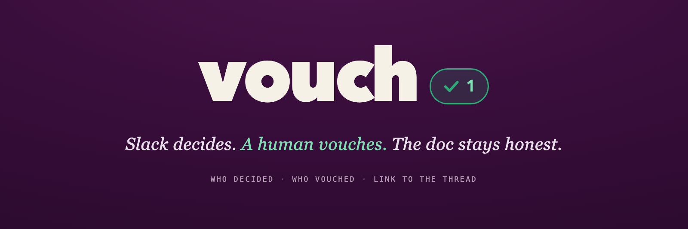

# vouch

Slack agent that keeps docs honestly fresh — catches decisions in Slack, gets a human to vouch, writes them back with provenance.

## How it works

1. **Listen** — a Slack bot watches a channel for messages that look like settled decisions (LLM-based detection).
2. **Nudge** — when a decision touches a doc section, the bot DMs the decision-maker with a proposed update and Accept / Edit / Dismiss buttons.
3. **Write back** — on accept, the section is updated and a provenance record (who vouched, source Slack message) is stored.
4. **Ask** — `/vouch status` shows what's fresh or stale; `/vouch why <section>` shows the provenance trail for any section.

Duplicate decisions are deduped via Slack Real-Time Search (`assistant.search.context`), which also enriches nudges with related discussions.

## Run the demo

One command replays a scripted conversation into your channel and drives the full loop live:

```sh
npm run demo
```

**First-time setup** (once): do steps 1–3 under [Running locally](#running-locally) — install, create the Slack app, fill `.env`. Notion is optional; without `NOTION_API_KEY` the write-back is skipped and everything else still runs. Set `VOUCH_ASSIGNEE_OVERRIDE` to your own Slack user ID so every nudge DMs you.

**What `npm run demo` does**, in order:

1. `wipe:channel` — clears the watched channel
2. `rm vouch.db` + `seed` — fresh DB with sample sections + bindings
3. `reset:notion` — clears prior callouts + Changelog (no-op if Notion is off)
4. `replay` — posts `fixtures/demo-buildup.json` into the channel (1.5s between messages) to build up context
5. `slack` — starts the live listener

**What you'll see:** as the build-up plays, then a decision-shaped message lands, the bot DMs you a nudge with Accept / Edit / Dismiss. Hit **Accept** → the section updates, a provenance record is stored, and (if Notion is on) a callout + Changelog entry appears in the doc. Try `/vouch status` and `/vouch why <section>` in Slack.

> The replay stays running as the live listener at the end — leave it up, post your own decision message, and watch it nudge. `Ctrl-C` to stop.

## Connect your whole workspace

The scripted demo above uses one seeded doc + one channel. To run Vouch against your **real** workspace — all your Notion docs (including ones you add later) and all public Slack channels:

**1. Connect Notion at the teamspace level.** In your Notion integration settings, connect it to the top-level teamspace (or the parent page) that holds your docs. Child pages inherit access, so docs you create later are automatically visible — no re-connecting.

**2. Import existing docs:**

```sh
npm run import:all -- --dry-run   # preview what would be imported, writes nothing
npm run import:all                # actually import
```

Each doc's headings become sections; the first paragraph under a heading is its writable value. Sections are workspace-global — a decision in any channel can update any doc.

**3. Set up the Notion webhook** (live pickup of new/edited docs). The receiver runs on `PORT` (default 3100) when you start the app, but Notion needs a public URL — expose it with a tunnel:

```sh
npx cloudflared tunnel --url http://localhost:3100    # or: ngrok http 3100
```

Add that URL as a webhook subscription in the integration settings. Notion first POSTs a verification token — it's printed in the app logs; paste it into the Notion UI to confirm, then set it as `NOTION_WEBHOOK_SECRET` in `.env` so later events are verified. New/edited pages now re-import within seconds. (No tunnel? `/vouch sync` rescans on demand.)

**4. Start the app** — it auto-joins every public channel (and any created later) and begins watching:

```sh
npm run slack
```

Post a decision in any public channel that matches one of your doc sections → you get a nudge → **Accept** writes it back with provenance.

> The bot must be a member of a channel to see its messages, so it joins all public channels on startup (each posts a visible "joined" line). Requires the `channels:join` scope — already in `slack-app-manifest.json`.

## Stack

- Node/TypeScript, single flat package
- SQLite (`better-sqlite3`) — local `vouch.db`, no server
- Slack Bolt (Socket Mode)
- LLM via Ollama Cloud's OpenAI-compatible endpoint (`openai` SDK)
- MCP server exposing the store as tools

## Layout

```
src/store           # SQLite store: bindings, sections, threads, provenance
src/mcp-server      # MCP server exposing the store as tools
src/reconciliation  # decision detection + resolution-note drafting
src/slack           # channel listener, DM nudge, /vouch command
src/rts             # Real-Time Search context-gathering + dedupe
scripts/replay.ts   # replay a message fixture into the channel
fixtures/           # demo + eval conversation fixtures
```

## Running locally

### Prerequisites

- Node 20+
- A Slack workspace where you can install apps
- An [Ollama Cloud](https://ollama.com) API key

### 1. Install

```sh
npm install
```

### 2. Create the Slack app

1. Go to [api.slack.com/apps](https://api.slack.com/apps) → **Create New App** → **From a manifest**, and paste `slack-app-manifest.json`.
2. Install the app to your workspace.
3. Generate an app-level token (Settings → Basic Information → App-Level Tokens) with the `connections:write` scope — this is `SLACK_APP_TOKEN`.
4. Grab the **Bot User OAuth Token** (`SLACK_BOT_TOKEN`) and **User OAuth Token** (`SLACK_USER_TOKEN`, needed for Real-Time Search) from OAuth & Permissions.
5. Invite the bot to the channel you want it to watch, and copy that channel's ID.

### 3. Configure

```sh
cp .env.example .env
```

Fill in:

| Variable | What it is |
|---|---|
| `SLACK_BOT_TOKEN` | Bot token (`xoxb-…`) |
| `SLACK_APP_TOKEN` | App-level token (`xapp-…`) for Socket Mode |
| `SLACK_USER_TOKEN` | User token (`xoxp-…`) for Real-Time Search |
| `SLACK_CHANNEL_ID` | Channel to watch (e.g. `C0123456789`) |
| `VOUCH_ASSIGNEE_OVERRIDE` | Optional: Slack user ID to send all nudges to (handy for demos) |
| `OLLAMA_API_KEY` | Ollama Cloud API key |
| `OLLAMA_BASE_URL` | Leave as `https://ollama.com/v1` |
| `NOTION_API_KEY` | Optional: for Notion write-back |

### 4. Seed and run

```sh
npm run seed    # create vouch.db with sample sections + bindings
npm run slack   # start the Slack listener (Socket Mode, no public URL needed)
```

Post a decision-shaped message in the watched channel (e.g. *"ok let's settle it — rate limit goes to 500 req/min for enterprise"*) and you should get a DM nudge. Try `/vouch status` and `/vouch why <section>` in Slack.

### Other commands

```sh
npm run import -- <pageId>               # import one Notion page (+ its sub-pages) → sections
npm run import:all                       # import every page the integration can access
npm run eval       # run decision detection against fixtures (offline, no Slack needed)
npm run mcp        # run the MCP server over stdio
npm run inspect    # open MCP Inspector against the server
npm run typecheck  # type-check
```

## License

See [LICENSE](LICENSE).
